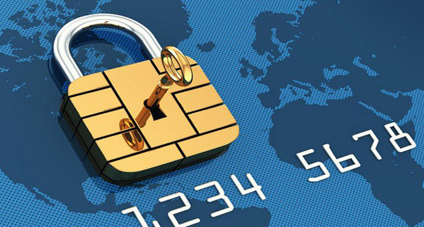
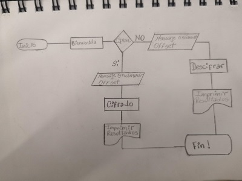
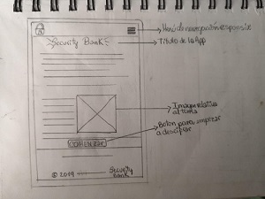
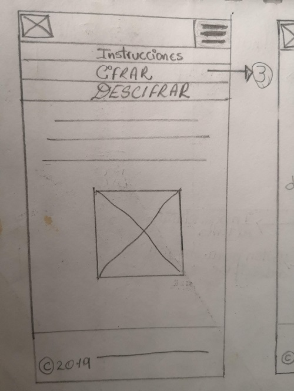
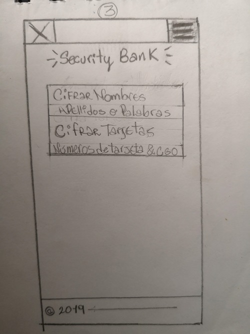
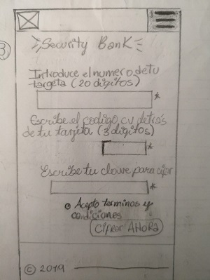
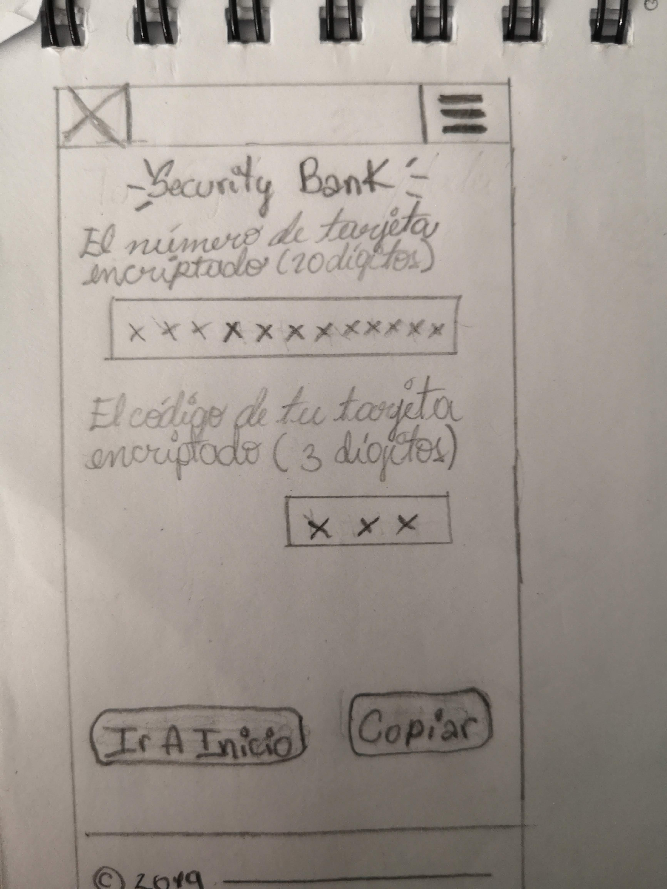
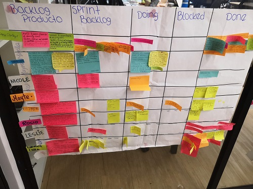
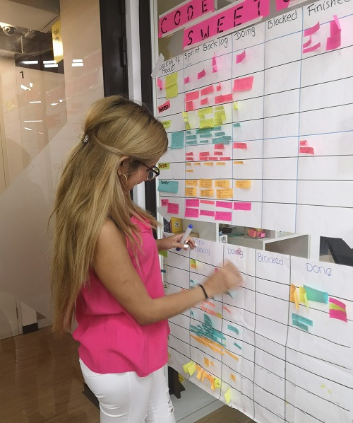

# Security Bank

## Índice

* [Preámbulo](#preámbulo)
* [Proceso de diseño](#proceso-de-diseño)
* [Historias de Usuario](#historias-de-Usuario)
* [Definición del producto](#definición-del-producto)
* [Interfaz de usuario (UI)](#interfaz-de-usuario-(UI))
* [Planning](#planning)
* [Checklist](#checklist)

***

## Preámbulo

En este mundo digital la privacidad y seguridad de los datos personales se encuentran en constante amenaza. Es por eso que **SECURITY BANK**, al estar enfocado en el mundo finaciero y seguridad de datos personales, le da al usuario la opción de crear mensajes cifrados y números de tarjetas bancarias para lograr una óptima seguridad y protección.

Para ello, **SECURITY BANK** cuenta con unos de los métodos de cifrado más conocidos **el Cifrado César** el cual consiste en: sustituir o desplazar una letra del texto original por otra que se encuentra en un número fijo de posiciones más adelante en el mismo alfabeto🔒💳 .

específicamente a los usuarios  permite a los usuarios crear contraseñas para proteger sus tarjetas,

Por ejemplo, si usamos un desplazamiento (_offset_) de 3 posiciones:

- La letra A se cifra como D.
- La palabra CASA se cifra como FDVD.
- Alfabeto sin cifrar: A B C D E F G H I J K L M N O P Q R S T U V W X Y Z
- Alfabeto cifrado: D E F G H I J K L M N O P Q R S T U V W X Y Z A B C

En la actualidad, todos los cifrados de sustitución simple se descifran con mucha facilidad y, aunque en la práctica no ofrecen mucha seguridad en la comunicación por sí mismos; el cifrado César sí puede formar parte de sistemas más complejos de codificación, como el cifrado Vigenère, e incluso tiene aplicación en el sistema ROT13.

## Proceso de diseño

### Descubrimiento e investigación 

 Debido a mi interés por solucionar problemas de robo o violación de datos personales en internet, decidí descubrir  en qué situaciones de la vida real una persona persona tendría la necesidad de cifrar sus datos o algún tipo de mensaje y en mi investigación realice preguntas a familiares y amigos para obtener un mejor enfoque para darles un producto que solucionara sus problemas o quizás darle la confianza y seguridad a sus datos personale a la hora de estar en internet. 

 Realice las siguientes preguntas : 
   **¿Por qué necesitamos encriptar tus datos?**  
   **¿Que tipo de datos te gustaría mantener cifrado con un número que puedas?**   
   **¿En qué momento tu necesitarías tus datos encriptados?**

### Síntesis y definición

En esta fase usamos los datos coleccionados en la fase de investigación y llegue a la conclusión que los deseos y necesidades del público es poder encriptar y desencriptar sus números de tarjetas bancarias y además de datos personales.

### Ideación

Ya en esta etapa, se pretende plasmar todas las definición del producto que le permitan al usuario tener una interfaz fácil de usar y amigable para cifrar sus números de tarjetas bancarias y sus datos personales utilizando una clave secreta y con la cual también podrá descifrar sus datos ya encriptados.

### Diagrama de flujo 

### Prototipo de baja fidelidad 

(Describir todo el proceso de diseño)

- Este proyecto se debe resolver de manera individual.
- El proyecto será entregado subiendo tu código a GitHub (commit/push) y la interfaz será desplegada usando GitHub pages. Si no sabes lo que es GitHub, no te preocupes, lo aprenderás durante este proyecto.

## Historias de Usuario

### Historia de Usuario 1  

**Yo como:** Usuario.    

**Quiero:** Al entrar a la página de inicio ver una descripción de la aplicación y testimonios de personas.  

**Funcionalidad:** Para que el usuario tenga una breve introducción de la aplicación.   

**Definición de terminado:** El usuario al entrar a la aplicación tendrá una descripción de **Security Bank** e imagenes referentes al tema.

### Historia de Usuario 2

**Yo como:** Usuario.    

**Quiero:** Cifrar datos personales en mayúscula y números de tarjetas bancarias, con una clave que puede ser un número positivo o negativo.   

**Funcionalidad:** Para que el usuario pueda cifrar sus datos y números de tarjetas bancarias con un número de desplazamiento negativo o positivo.

**Definición de terminado:** El usuario ingresará sus datos personales o número de tarjeta en un input y en el otro input ingresa el número de desplazamiento y al darle click a cifrar le de un mensaje cifrado.

### Historia de Usuario 3

**Yo como:** Usuario.   

**Quiero:** Descifrar datos personales en mayúscula y números de tarjetas bancarias, con una clave que puede ser un número positivo o negativo.   

**Funcionalidad:** Para que el usuario pueda descifrar sus datos y números de tarjetas bancarias con un número de desplazamiento negativo o positivo.  

**Definición de terminado:** El usuario ingresará sus datos personales o número de tarjeta cifrados en un input y en el otro input ingresa el número de desplazamiento y al darle click a descifrar le de un mensaje descifrado.

## Definición del producto

En el README.md, cuéntanos cómo pensaste en los usuarios y cuál fue tu proceso para definir el producto final a nivel de experiencia y de interfaz.
- Entender las **necesidades del usuario** y cómo proponer una solución.
- Organizar tu tiempo y priorizar tareas en un entorno de **alta incertidumbre**.

#### ¿Quiénes son los principales usuarios de producto.?

 Los principales usuarios de la herramienta digital **Security Bank** son todos aquellos usuarios que necesitan proteger sus datos y números de tarjetas de crédito a la hora de compartir con un familiar o persona de su confianza.

#### ¿Cuáles son los objetivos de estos usuarios en relación con tu producto?
 Los objetos principales son que el usuario al usar esta aplicación pueda cifrar su tarjetas y datos personales con un número de desplazamiento y al compartirlo con su receptor sólo podrá descifrarlo con el número de desplazamiento compartido. La aplicación debe ser sencilla de usar y sobretodo muy útil para el usuario y tenga una sensación de seguridad y confianza a la hora de compartir sus números de tarjetas con alguien más que solo pueda saber con quien comparta el offset o clave secreta para tener una comunicación más secreta.

#### ¿Cómo crees que el producto que estás creando está resolviendo sus problemas?
 
 El producto está resolviendo problemas de inseguridad o de robo de números de tarjetas, ya que solo con quien el usuario comparta su número de tarjetas cifrada y clave secreta serán los únicos en tener acceso a los datos reales a la hora de descifrar el mensaje secreto.

## Interfaz de usuario (UI)

### Interfaz para Desktop o PC

### Interfaz para Mobile

(Usar una gif de la UI de la pag)

## Planning
El proyecto se realizó en 2 semanas, se trabajó en dos sprints de una semana cada uno y planifique mis tareas usando la metodología scrum o agile.

### Tablero Kanban
El tablero kanban me fue una excelente herramienta de ejecutar la metodología scrum y gestionar el proyecto, me ayudó mucho a ver mi progreso y detectar obstáculos.

## Checklist

Esta sección está  mostrar los requerimientos que he completado.

### Parte Obligatoria

☑ `README.md` incluye info sobre proceso y decisiones de diseño.  

☑ `README.md` explica claramente quiénes son los usuarios y su relación con el producto.

☑ `README.md` explica claramente cómo el producto soluciona los problemas/necesidades de los usuarios.

☑ Usa VanillaJS.

☑ No utiliza `this`.

☑ Implementa `cipher.encode`.

☑ Implementa `cipher.decode`.

☑ Pasa linter con configuración provista.

☑ Pasa pruebas unitarias.

☑ Pruebas unitarias cubren 70% de _statements_, _functions_ y _lines_, y un
  mínimo del 50% de _branches_.

☑ Interfaz permite elegir el `offset` o _desplazamiento_ a usar en el
  cifrado/descifrado.

☑ Interfaz permite escribir un texto para ser cifrado.

☑ Interfaz muestra el resultado del cifrado correctamente.

☑ Interfaz permite escribir un texto para ser descifrado.

☑ Interfaz muestra el resultado del descifrado correctamente.

### Parte Opcional: "Hacker edition"

☑ Cifra/descifra minúsculas

* [ ] Cifra/descifra _otros_ caracteres (espacios, puntuación, `ñ`, `á`, ...)

☑ Permite usar un `offset` negativo.
